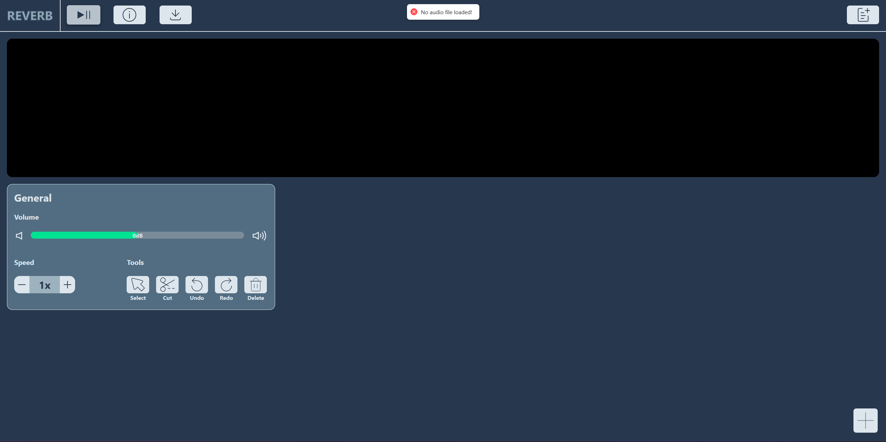
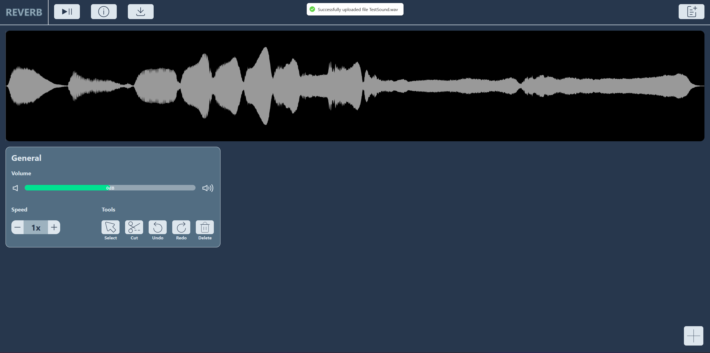
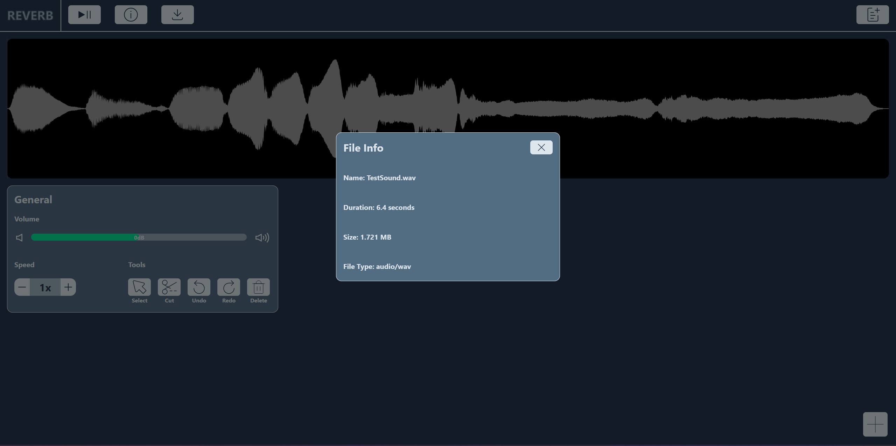
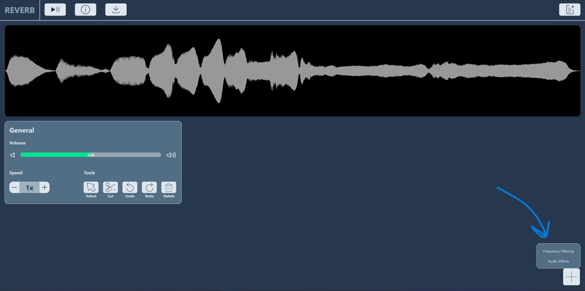
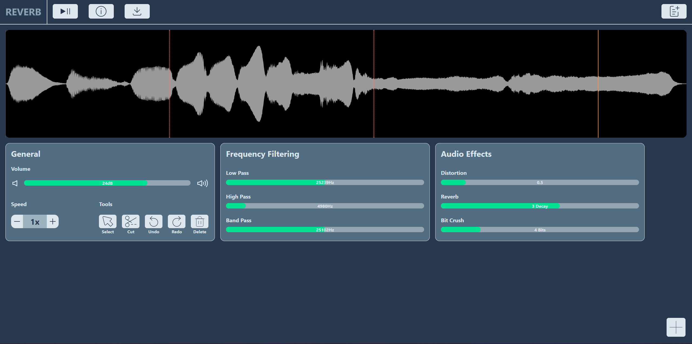
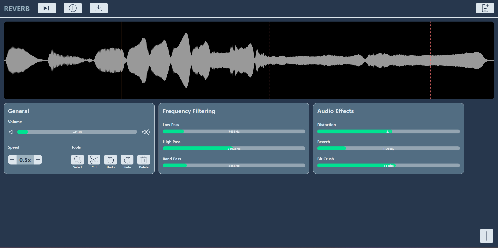
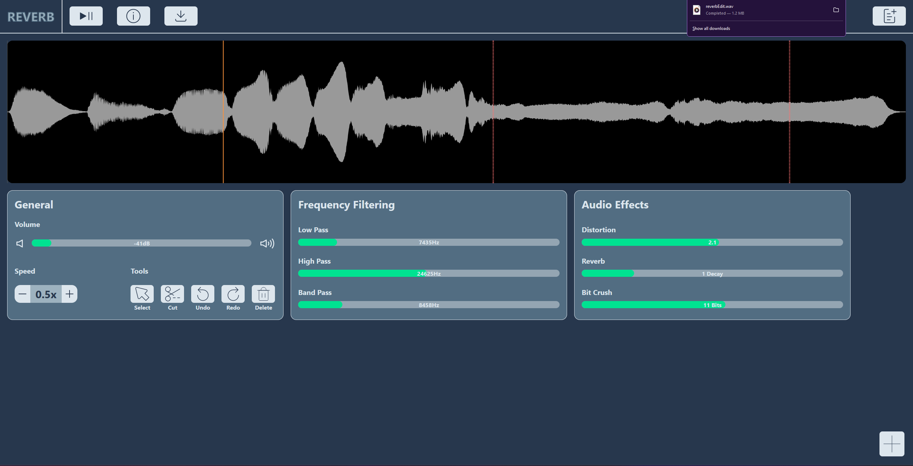

# Reverb - CS322 Music Programming Project

## Description

- Reverb is a web application which enables users to edit their audio files directly in the browser without having to download any external software.​
- The goal is to create a beginner friendly and simplified audio editing interface so that it is accessible to as many people as possible.
- This project was created as part of the CS322: Music Programming 2 module at <a href="https://www.maynoothuniversity.ie/">Maynooth University</a> in my first semester of my final year.

## Technology

- NextJS
- TailwindCSS
- JavaScript

## Setup Guide

These instructions will help you set up the project on your local machine for running your own instance of Reverb.

### Installation

- Clone the repository: `git clone https://gitlab.cs.nuim.ie/u210285/cs322-fy_s1-project.git`
- Navigate to the project directory: `cd cs322-fy_s1-project`
- Install all dependencies: `npm install` or `npm i`
- Type `npm run dev` on the terminal to start running the application. (This will automatically restart the application when you make changes to the code)

## Screenshots

### Main Page (trying to interact when no audio file uploaded)

### Success Uploading Audio File

### Audio File Information

### Dropdown For Adding More Features

### First Segment Edited

### Second Segment Edited

### Download Edited Audio File

## Future Work

- Fix pause causing audio to restart bug
- Being able to move the cut segments around
- Fix the bug where the features that are added from dropdown menu are not added in the order they were clicked
- Undo/Redo functionality

## Authors

- Boris Stavisky
- Jack White
- Kevin Xia
